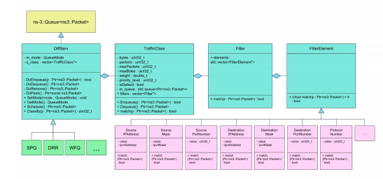

# Network Simulation & Differentiated Services

(please refer to the Differentiated-Services pdf for more details)

Project to implement a selection of differentiated services.Two quality-of-service (QoS) mechanisms have been implemented: SPQ and DRR. 

**Part 1** involved building the base DiffServ class, and the TrafficClass, Filter, and FilterElements classes.

**Part 2** used the base DiffServ class to implement Strict Priority Queue (SPQ) and Deficit Round Robin (DRR).

**Part 3** ran both the QoS implementations and captured the network data to verify SPQ and DRR behaved properly.

## Build and Run
Assuming ns-3 and it's dependencies have been installed and the config files have been properly formatted.

To run the project, navigate to the ns-3.38 folder.

To run using the **SPQ** config file and the SPQ Qos:

`./ns3 run 'scratch/p2main --config=scratch/configSPQ.json'`


To run using the **DRR** config file and the DRR Qos:

`./ns3 run 'scratch/p2main --config=scratch/configDRR.json'`

## Requirements
This project uses rapidjson to parse the JSON config files.
The relevant rapidjson folder and files are included with the repository.

The configSPQ.json and configDRR.json must be properly constructed and have the correct parameters.

configSPQ.json example:

```
{
    "numQueues": 2,
    "priority": [2, 1],
    "srcIP": "172.168.1.0",
    "destIP": "172.168.2.0",
    "srcMask": "255.255.255.0",
    "destMask": "255.255.255.0",
    "srcPort1": 1000,
    "srcPort2": 2000,
    "destPort1": 1000,
    "destPort2": 2000,
    "protocol": 17,
    "isSPQ": true
}
```

configDRR.json example:
```
{
    "numQueues": 3,
    "weight": [300, 200, 100],
    "srcIP": "172.168.1.0",
    "destIP": "172.168.2.0",
    "srcMask": "255.255.255.0",
    "destMask": "255.255.255.0",
    "srcPort1": 1000,
    "srcPort2": 2000,
    "destPort1": 1000,
    "destPort2": 2000,
    "destPort3": 3000,
    "protocol": 17,
    "isSPQ": false
}
```

## Implementation Notes
The project uses ns-3 to build the three network topology. UDPClient and UDPServer are used to send and receive UDP packets.

The relevant project files are in the /scratch folder. Pcap files and the graphs for I/O are in the /pcap_files folder.

Here is an image of the base DiffServ class structure and inheritance:




Here's a preview of how the topology is setup:

```
       172.168.1.0        172.168.2.0
       
n0 -------------- n1 -------------- n2

     Link1    (router)    Link2
    
```

Node n0 acts as the client, n2 as the server, and n1 serves as the router.
The SPQ or DRR QoS implementations are installed on the router node.

To replicate the pcap file performance:

**SPQ:**

  Link1 DataRate: 20Mbps<br>
  Link1 Delay: 10ms<br>
  Link2 DataRate: 5Mbps<br>
  Link2 Delay: 10ms<br>
  
  MaxPackets: 1000<br>
  Packets sent: 50000<br>
  UDPclient1 start time: 5 seconds <br>
  UDPclient1 end time: 150 seconds <br>
  UDPclient2 start time: 15 seconds <br>
  UDPclient2 end time: 150 seconds <br>
  UDPclient interval: 0.001 seconds <br>
  UDPserver start time: 1 second <br>
  UDPserver end time: 300 seconds <br>
 
**DRR:**

  Link1 DataRate: 20Mbps<br>
  Link1 Delay: 10ms<br>
  Link2 DataRate: 5Mbps<br>
  Link2 Delay: 10ms<br>
  
  MaxPackets: 10000<br>
  Packets sent: 50000<br>
  UDPclient1 start time: 5 seconds <br>
  UDPclient1 end time: 150 seconds <br>
  UDPclient2 start time: 5 seconds <br>
  UDPclient2 end time: 150 seconds <br>
  UDPclient3 start time: 5 seconds <br>
  UDPclient3 end time: 150 seconds <br>
  UDPclient interval: 0.001 seconds <br>
  UDPserver start time: 1 second <br>
  UDPserver end time: 300 seconds <br>

## External Resources Used
rapidjson to parse json files.

[Efficient Fair Queueing using Deficit Round Robin](http://cs621.cs.usfca.edu/v/resources/drr.pdf) by Shreedar and Varghese <br>
Provided the pseudocode for the DRR schedule, dequeue, and enqueue functions.<br>


